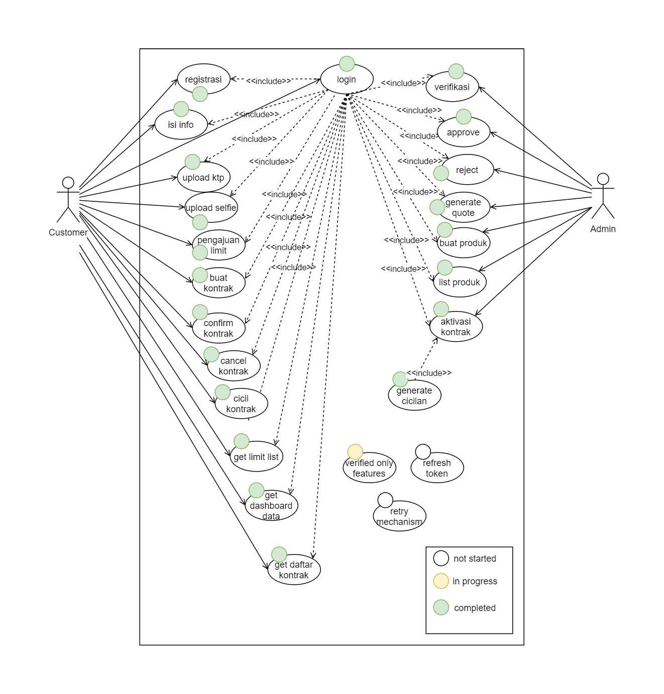
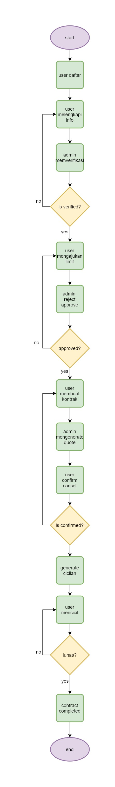
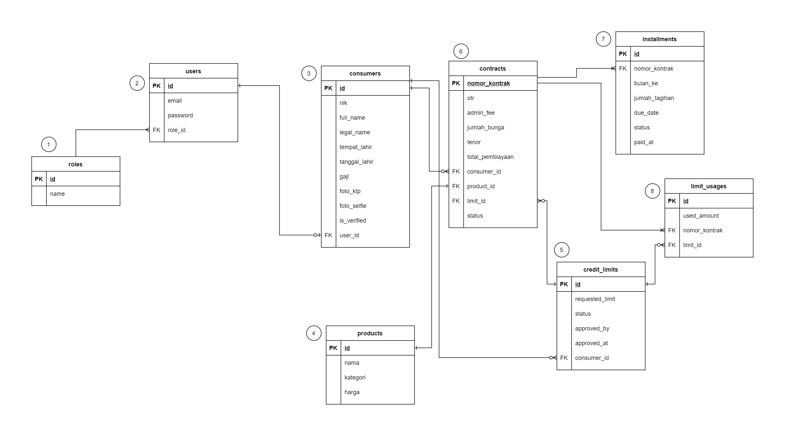
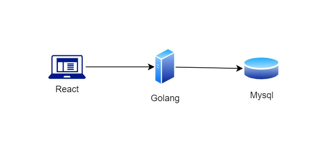

# Docs

## Diagram

### Use Case

### Flow

### ERD

### Infra

## List of Dependencies

1. [golang](https://go.dev/dl/) current version 1.25.4
2. [httprouter](https://github.com/julienschmidt/httprouter)
3. [mysql_driver](https://github.com/go-sql-driver/mysql)
4. [godotenv](https://github.com/joho/godotenv)
